Estimating COVID-19 new cases and unlockdown date.

Data is from [humdata.org]. Here 2-week avg. of new cases
is curve fitted with sum of 2 bell shaped curves (gaussian
functions), representing 2 possible effects.

## china

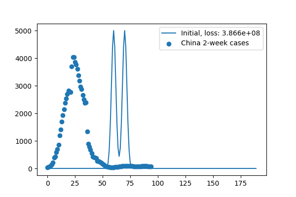

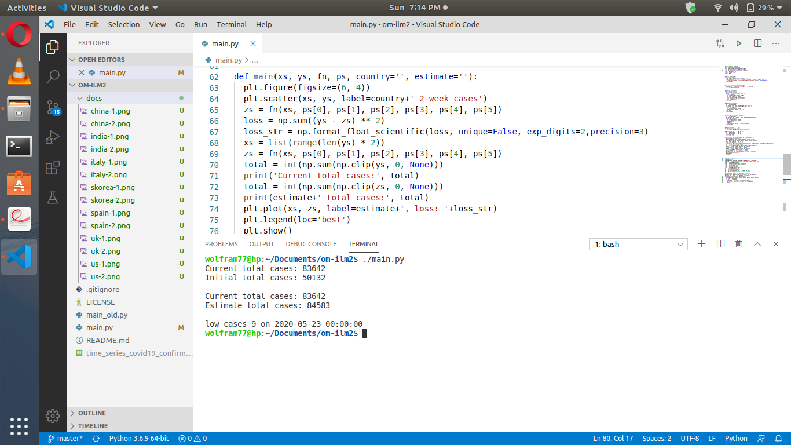

## india

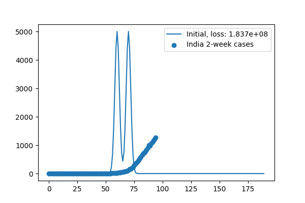

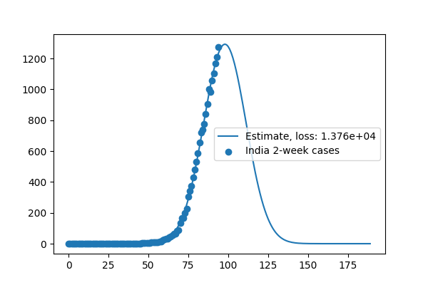

## italy

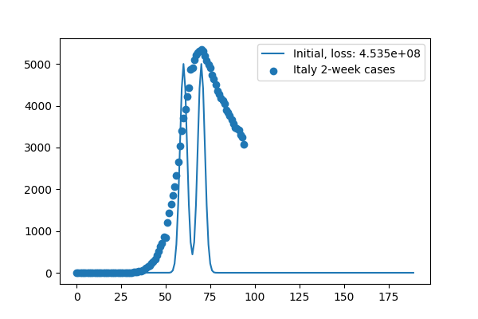

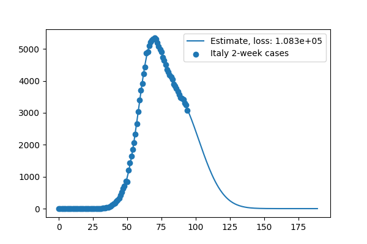

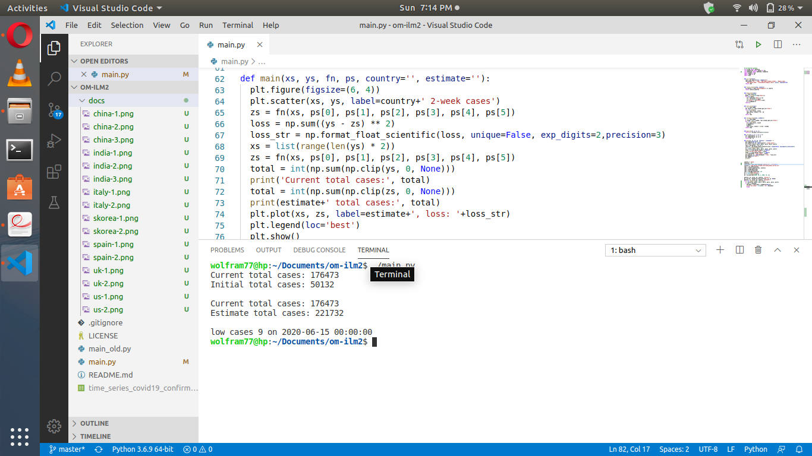

## skorea

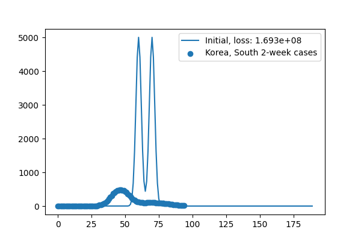

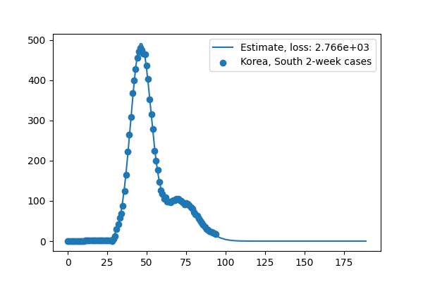

## spain

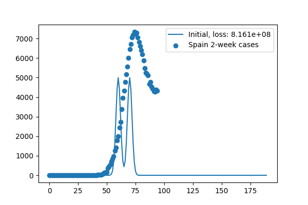

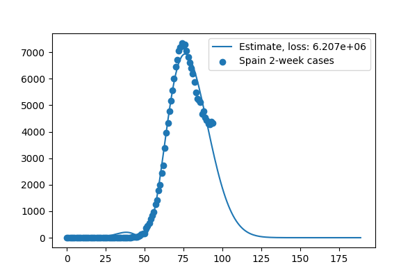

## uk

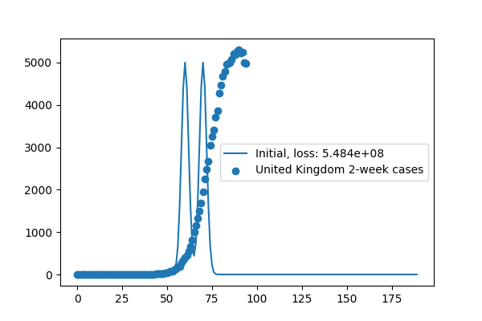

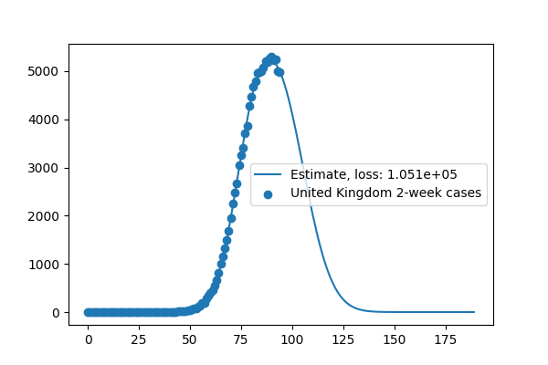

## us

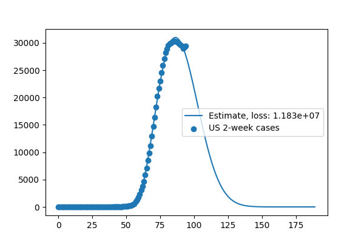

[humdata.org]: https://data.humdata.org/dataset/novel-coronavirus-2019-ncov-cases
